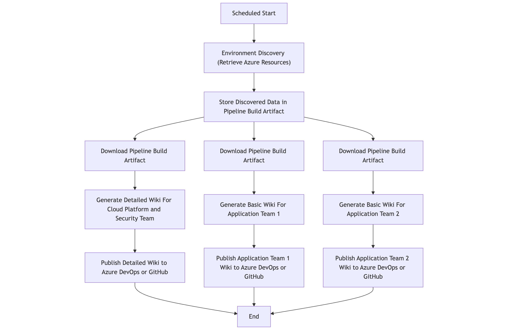

# Documentation and Instructions

## Supported Platforms

The following DevOps / CICD platforms are supported:

- [Azure DevOps](https://azure.microsoft.com/products/devops)
- [GitHub Actions](https://github.com/features/actions)

The pipelines utilize the [AzPolicyLens](https://aka.ms/AzPolicyLens) PowerShell module and generate markdown documentation for Azure Policy that can be published as either an Azure DevOps or GitHub Wiki.

## Process Overview

The automated policy documentation is generated using the either the Azure DevOps or GitHub Actions pipelines from this repository.

These pipelines can be configured ton run on a schedule or triggered manually., ensuring that the documentation is always up-to-date with the latest policies.

The pipelines retrieve all relevant Azure resources using Azure Resource Graph queries and then generates policy documentations in markdown files that are compatible with the Azure DevOps code wiki or GitHub wiki.

The pipelines can be customized to suit specific requirements. Below is a high-level overview of the process for a typical environment:

<!-- Mermaid diagram
#flowchart TD
A[Scheduled Start] -> B["Environment Discovery (Retrieve Azure Resources)"]
B -> C[Store Discovered Data in Pipeline Build Artifact]
C -> D0[Download Pipeline Build Artifact]
D0 -> D1[Generate Detailed Wiki For Cloud Platform and Security Team]
D1 -> D2[Publish Detailed Wiki to Azure DevOps or GitHub]
C -> E0[Download Pipeline Build Artifact]
E0 -> E1[Generate Basic Wiki For Application Team 1]
E1 -> E2[Publish Application Team 1 Wiki to Azure DevOps or GitHub]
C -> F0[Download Pipeline Build Artifact]
F0 -> F1[Generate Basic Wiki For Application Team 2]
F1 -> F2[Publish Application Team 2 Wiki to Azure DevOps or GitHub]
D2 -> G[End]
E2 -> G[End]
F2 -> G[End]
-->

## Policy Documentation Wikis

The wikis generated by the automated AzPolicyLens solution can be broadly categorized into two types:

 - **Detailed Wiki for Cloud Platform and Security Teams**: This wiki provides comprehensive documentation of all Azure Policies applied across the entire Azure environment. It includes detailed information on each policy, its purpose, scope, and compliance status. This wiki is intended for cloud platform and security teams responsible for managing and monitoring Azure Policies.
 - **Basic Wiki for Application Teams**: This wiki provides a simplified view of Azure Policies relevant to specific application teams. It focuses on the policies that impact their applications and workloads, helping them understand compliance requirements and manage policy exemptions.

### Target Audience

| Wiki Type | Target Audience |
| :-------- | :-------------- |
| Detailed Wiki | • Cloud Platform Teams • Cloud Architects • Security Teams • Audit Teams |
| Basic Wiki | • Application Developers • Application Support Teams • Application Owners and Architects • Application Security Teams |

### Feature Comparison

The table below summarizes the key features of each wiki type:

<table>
  <tr>
    <th>Feature</th>
    <th style="text-align: center">Detailed Wiki</th>
    <th style="text-align: center">Basic Wiki</th>
  </tr>
  <tr>
    <td colspan="3"><strong>Policy Resources</strong></td>
  </tr>
  <tr>
    <td>All Policy Assignments under Management Group</td>
    <td style="text-align: center">✅</td>
    <td style="text-align: center"></td>
  </tr>
  <tr>
    <td>Policy Assignments that affects specific subscription(s) used by the application team</td>
    <td style="text-align: center"></td>
    <td style="text-align: center">✅</td>
  </tr>
  <tr>
    <td>All Policy Initiatives under Management Group</td>
    <td style="text-align: center">✅</td>
    <td style="text-align: center"></td>
  </tr>
  <tr>
    <td>Policy Initiatives assigned by the Policy Assignments that affect specific subscription(s) used by the application team</td>
    <td style="text-align: center"></td>
    <td style="text-align: center">✅</td>
  </tr>
  <tr>
    <td>All Policy Definitions used by Policy initiatives or directly assigned by policy assignments</td>
    <td style="text-align: center">✅</td>
    <td style="text-align: center"></td>
  </tr>
  <tr>
    <td>Policy Definitions used by the Policy Initiatives or directly assigned by the Policy Assignments that affect specific subscription(s) used by the application team</td>
    <td style="text-align: center"></td>
    <td style="text-align: center">✅</td>
  </tr>
  <tr>
    <td>All Policy Exemptions created for the Policy Assignments</td>
    <td style="text-align: center">✅</td>
    <td style="text-align: center"></td>
  </tr>
  <tr>
    <td>Policy Exemptions created for the Policy Assignments that affect specific subscription(s) used by the application team</td>
    <td style="text-align: center"></td>
    <td style="text-align: center">✅</td>
  </tr>
  <tr>
    <td>All Unassigned custom policy definitions and initiatives</td>
    <td style="text-align: center">✅</td>
    <td style="text-align: center"></td>
  </tr>
  <tr>
    <td>All assigned deprecated policy definitions and initiatives</td>
    <td style="text-align: center">✅</td>
    <td style="text-align: center"></td>
  </tr>
  <tr>
    <td>Any metadata defined for the policy resources with <code>hidden-</code> or <code>hidden_</code> prefixes</td>
    <td style="text-align: center">✅</td>
    <td style="text-align: center"></td>
  </tr>
  <tr>
    <td colspan="3"><strong>Azure Resources</strong></td>
  </tr>
  <tr>
    <td>All Role Assignments created by the Policy Assignments</td>
    <td style="text-align: center">✅</td>
    <td style="text-align: center"></td>
  </tr>
  <tr>
    <td>Role Assignments created by the Policy Assignments that affect specific subscription(s) used by the application team</td>
    <td style="text-align: center"></td>
    <td style="text-align: center">✅</td>
  </tr>
  <tr>
    <td>Hidden tags (tags with <code>hidden-</code> prefix)</td>
    <td style="text-align: center">✅</td>
    <td style="text-align: center"></td>
  </tr>
  <tr>
    <td>Management Group Hierarchy Overview</td>
    <td style="text-align: center">✅</td>
    <td style="text-align: center"></td>
  </tr>
  <tr>
    <td colspan="3"><strong>Security and Compliance</strong></td>
  </tr>
  <tr>
    <td>Policy Compliance Status</td>
    <td style="text-align: center">✅</td>
    <td style="text-align: center">✅</td>
  </tr>
  <tr>
    <td>Overall Policy Control Coverage and Compliance Summary</td>
    <td style="text-align: center">✅</td>
    <td style="text-align: center"></td>
  </tr>
  <tr>
    <td>Policy Control Coverage and Compliance Summary for the subscription(s) used by the application team</td>
    <td style="text-align: center"></td>
    <td style="text-align: center">✅</td>
  </tr>
  <tr>
    <td>Security Control Catalog (Library of all the security control frameworks used by the organization)</td>
    <td style="text-align: center">✅</td>
    <td style="text-align: center"></td>
  </tr>
  <tr>
    <td colspan="3"><strong>Other Features</strong></td>
  </tr>
  <tr>
    <td>Recommendations and Best Practice Analysis</td>
    <td style="text-align: center">✅</td>
    <td style="text-align: center"></td>
  </tr>
</table>

## Prerequisites

The following prerequisites are required for both `Azure Devops` and `GitHub` wikis:

| Name | Description |
| :--- | :---------- |
| Azure DevOps or GitHub | Azure DevOps organization or GitHub repository where the pipelines are executed and wikis are published. |
| Azure Service Principal | An Azure Service Principal with reader role for the Azure Management Group the wikis cover. |

The following additional prerequisites are required for `Azure DevOps` wikis:

| Name | Description |
| :--- | :---------- |
| Azure DevOps Organization | An Azure DevOps organization to host the pipelines and wikis. The wikis and pipelines must be hosted in projects with the same organization. |
| Azure DevOps Project for the Auto Documentation Pipelines | An Azure DevOps project to host the policy documentation pipelines. |
| Azure DevOps Projects for the Wikis | Separate Azure DevOps projects to host the generated wikis. |

The following additional prerequisites are required for `GitHub` wikis:

| Name | Description |
| :--- | :---------- |
| GitHub Repository for the Auto Documentation Pipelines | A GitHub repository to host the policy documentation pipelines. |
| GitHub Repositories for the Wikis | Separate GitHub repositories to host the generated wikis. |
| A GitHub Account that has access to the wiki repositories | A GitHub account with write access to the wiki repositories to allow the pipelines to publish the generated wikis. |
| Fine grained Personal Access Token (PAT) for GitHub | A GitHub PAT to be used by the GitHub Action workflow to publish the wikis to wiki repositories. |

## Repository File Structure

The file and folder structure of this repository is documented in the [Repository File Structure document](./repository-file-structure.md).

## How-To Guides

- [Azure DevOps Wiki Setup Guide](./how-to/ado-wiki-setup.md)
- [GitHub Wiki Setup Guide](./how-to/github-wiki-setup.md)
- [How to Map Security Controls to Azure Policies](./how-to/map-security-controls.md)
- [How to Manually Generate Policy Wiki](./how-to/manually-generate-policy-wiki.md)
- [How to Setup Pipeline Schedules](./how-to/pipeline-schedules.md)
- [Managing Pipeline Configuration File](./how-to/pipeline-configuration-file.md)
- [Managing Pipeline Variable File](./how-to/pipeline-variable-file.md)
- [Create Custom Security Control Catalog](./how-to/custom-security-control-catalog.md)
- [Define Additional Built-In Policy Metadata](./how-to/additional-built-in-policy-metadata.md)
- [Create Encryption key for Environment Discovery Artifact](./how-to/encryption-key-environment-discovery.md)

## Frequently Asked Questions (FAQ)

The [FAQ document](./faq.md) provides answers to common questions regarding the AzPolicyLens automated policy documentation solution.
