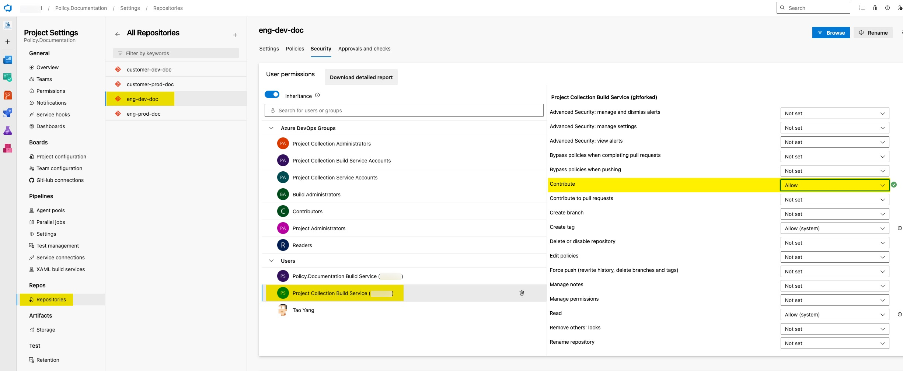
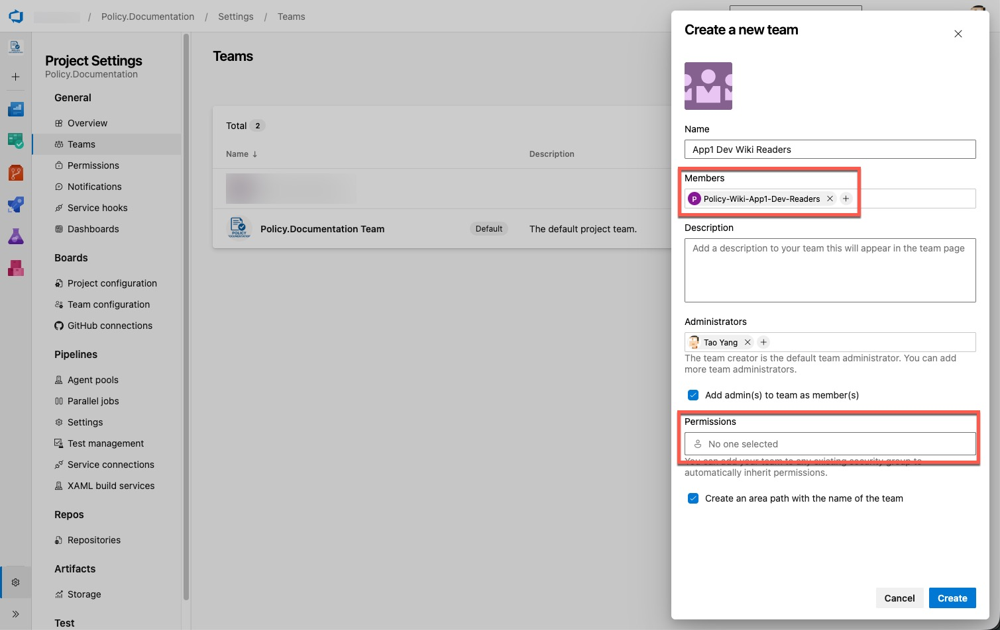
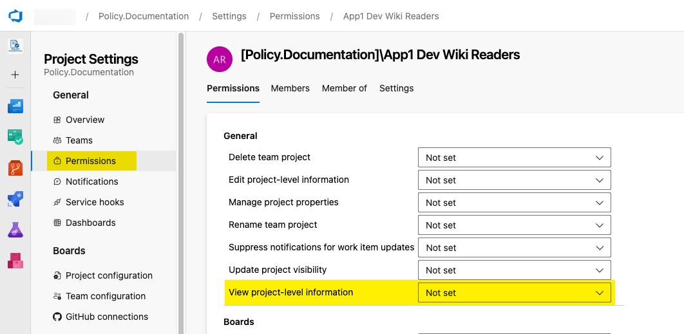
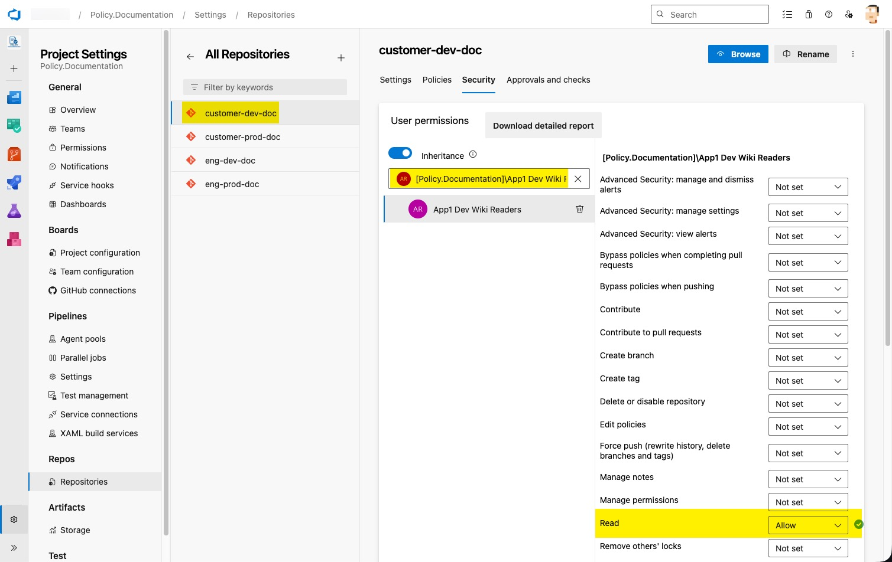
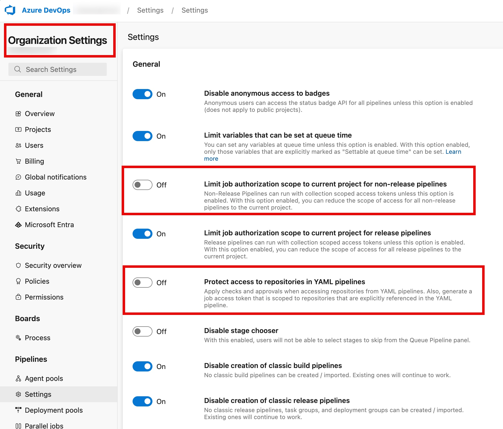
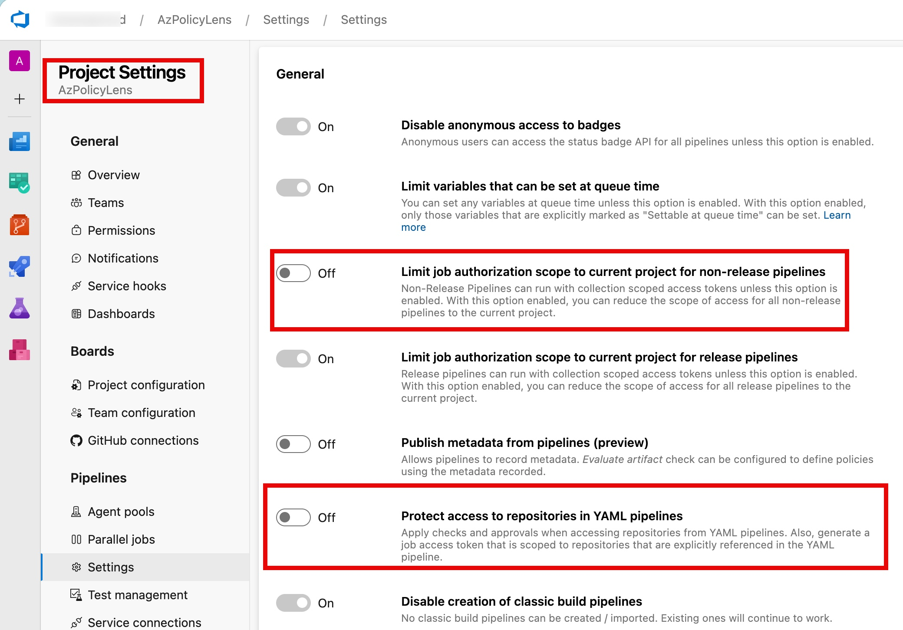
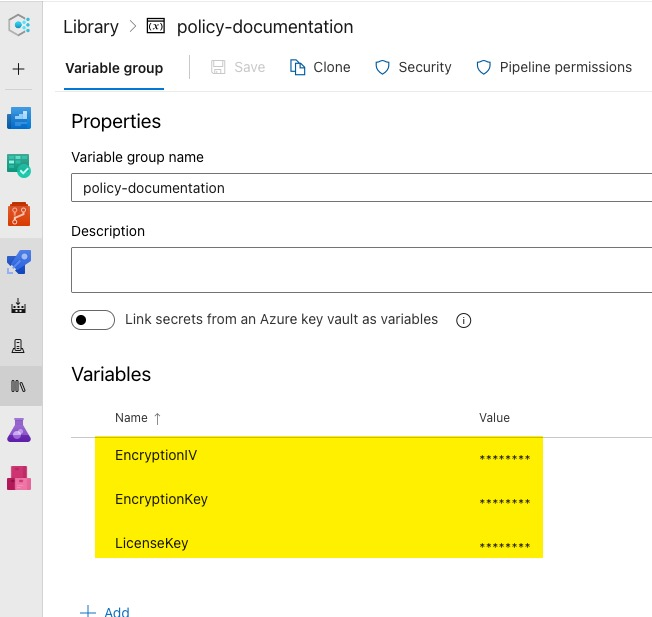
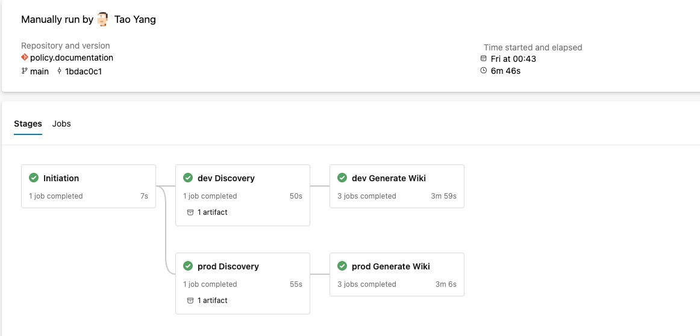
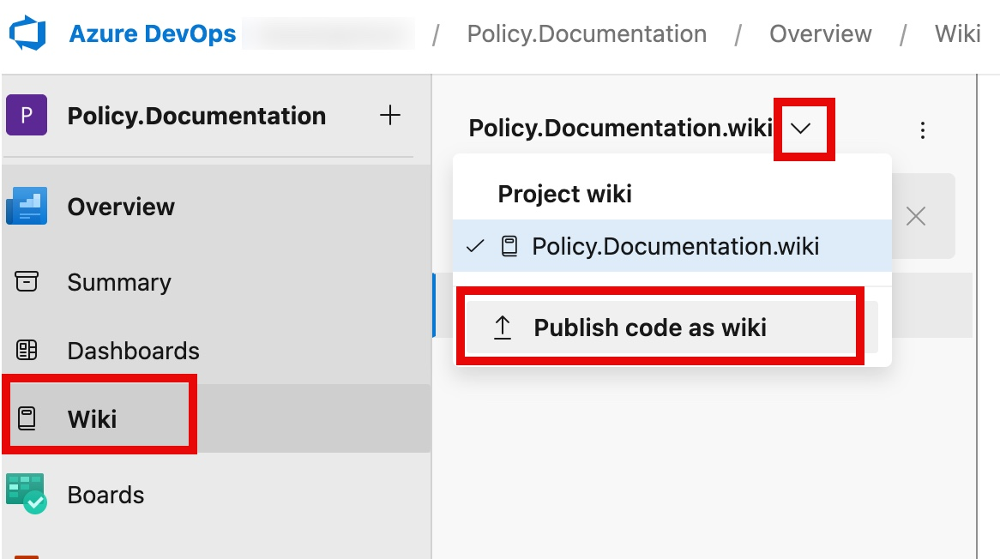

# Azure DevOps Wiki Setup Guide

## Introduction

This documentation provides a step-by-step guide on how to set up the Azure DevOps pipeline to automatically generate and publish the policy wiki to your Azure DevOps Wiki repository.

This pipeline is configured to run on a schedule, ensuring that the documentation is always up-to-date with the latest policies.

The pipeline retrieves all relevant Azure resources using Azure Resource Graph queries and then generates policy documentations in markdown files that are compatible with the Azure DevOps code wiki.

:::mermaid
flowchart TD
    A[Scheduled Start] --> B["Environment Discovery (Retrieve Azure Resources)"]
    B --> C[Store Discovered Data in Pipeline Build Artifact]
    C --> D0[Download Pipeline Build Artifact]
    D0 --> D1[Generate Wiki For Engineering Team]
    D1 --> D2[Publish Engineering Wiki to Azure DevOps]
    C --> E0[Download Pipeline Build Artifact]
    E0 --> E1[Generate Wiki For Customer 1]
    E1 --> E2[Publish Customer 1 Wiki to Azure DevOps]
    C --> F0[Download Pipeline Build Artifact]
    F0 --> F1[Generate Wiki For Customer 2]
    F1 --> F2[Publish Customer 2 Wiki to Azure DevOps]
    D2 --> G[End]
    E2 --> G[End]
    F2 --> G[End]
:::

## Prerequisites

### 1. Azure DevOps Organization and Project

You need to have an Azure DevOps organization and a project where you host and execute the policy wiki pipeline.

### 2. Separate Azure DevOps Project for Wiki Repositories

It is recommended to have a separate Azure DevOps project to host the Policy wiki repositories to avoid potential permission issues and to have a clear separation of permission boundary between the process automation and customers consuming the wiki.

### 3. Service Connection For Azure Management Group

The Azure Pipeline is structured to generate wikis for different environment where each environment corresponds to a top-level Azure Management Group.

You need to create a service connection in Azure DevOps that has the **Reader** role for each of the top-level management group you wish to target your policy wikis to.

### 4. Git Repository for Wiki

For each instance of the Policy wiki you wish to create, you need to create a git repository in the Azure Devops project you've created in step 2 to host the wiki content. The repository should be initialized with a README.md file.

### 5. Software requirements for the pipeline agents

If you are using Microsoft hosted agents, there is no additional software requirement as the necessary tools are already installed. If you are using self-hosted agents, please ensure that the following software is installed:

- PowerShell 7.2 or above
- Azure CLI or Az PowerShell Module (for generating Azure oAuth token during the wiki generation process)
- Git (for pushing the generated wiki content to the Azure DevOps Wiki repository)
- AzPolicyTest PowerShell Module version 3.2.0 or later (for syntax validation of policy definitions and initiatives during the wiki generation process)

For self-hosted agents, the agents must be able to access the Azure Resource Manager API endpoints (https://management.azure.com/).

## Setup Instructions

### 1. Configure the Wiki Git Repositories

For each git repository that you have created to host the wiki content, you need to make the following configurations:

- **Grant the `Project Collection Build Service (ado-org-name)` user the `Contribute` permission**. This is required for the pipeline to be able to commit changes to the repository.



- **Create a new ADO team for the customer wiki**. If the wiki is created for a team other than the team that manages the Azure DevOps project, within the ADO project for the wiki repositories, create a new Azure DevOps team for the consumer of this particular instance of the wiki. Add an Entra ID group for the customer to this team. Do not grant any project level permissions to this team.



- **Grant the customer ADO team permission to the wiki project**. This team needs `View project-level information` permission on the project level



- **Grant the customer ADO team permission to the wiki git repo**. After the team is created, you will need to grant the team `Read` permission to the wiki repository. This is required for the customer to be able to view the code wiki.



:exclamation: **IMPORTANT**: Make sure the permission is assigned on the individual repository level. Customers **SHOULD NOT** have permissions to view the entire project or other repositories in the project. This is to ensure that customers can only view their own wiki and not other customers' wikis.

- **Disable the Organization level pipeline setting `Limit job authorization scope to current project for non-release pipelines`**. This setting must be disabled on the organization level so it can be customized on the project level.

- **Disable the Organiaztion level pipeline setting `Protect access to repositories in YAML pipelines`**. This setting must be disabled on the organization level so it can be customized on the project level.



- **In the project where the pipeline is hosted, disaable the Project level pipeline setting `Limit job authorization scope to current project for non-release pipelines`**. This setting must be disabled on the project level so PAT token generated by the pipeline is scoped on the organization level. This is required so the pipeline can access git repositories from other projects (as long as the Project Collection Build Service has the necessary permissions).

- **In the project where the pipeline is hosted, disable the Project level pipeline setting `Protect access to repositories in YAML pipelines`**. This setting must be disabled on the project level so pipeline can access repositories.



### 2. Configure the Pipeline to Publish to the Wiki Repository

To add the new wiki configurations to the pipeline, you will need to edit the [ado-config.jsonc](../../configurations/ado-config.jsonc) file in the `policies` repository.

Follow the steps from the [Managing Pipeline Configuration Files](./pipeline-configuration-file.md) page to update the `ado-config.jsonc` file.

### 3. Configure additional metadata for the wiki (Strongly Recommended)

:memo: Refer to the [Define Additional Built-In Policy Metadata](./additional-built-in-policy-metadata.md) guide for details about this feature.

Follow the steps from [Managing Pipeline Configuration Files](./pipeline-configuration-file.md) page to update the `additional-policy-metadata-config.jsonc` file.

### 4. Define Custom Security Controls (Optional)

If you have internal security controls or security controls that are not available in Azure as built-in policy metadata, you can define them as custom security controls and include them in the policy wiki.

Follow the steps from the [Create Custom Security Control Catalog](./custom-security-control-catalog.md) guide to define your custom security controls and include them in the policy wiki.

Before you generate the policy wiki, please also make sure the security controls are properly mapped to the relevant policy definitions in the initiative definitions. You can follow the steps from the [How to Map Security Controls to Azure Policies](./map-security-controls.md) guide to do this.

### 5. Configure the Pipeline Schedule

Follow the steps from the [How to Setup Pipeline and Workflow Schedules](./pipeline-schedules.md) page to set up the pipeline schedule to suit your business requirements.

### 6. Generate an Encryption Key for Encrypting the Discovery Artifact (Optional but Strongly Recommended)

The environment discovery artifact contains the details of your Azure environment, which may include sensitive information. It is recommended to encrypt the discovery artifact before storing it as a pipeline artifact and decrypt it during the wiki generation process.

Follow the steps from the [Create Encryption Key for Environment Discovery Artifact](./encryption-key-environment-discovery.md) guide to create the encryption key for the pipeline to use.

You will need to store the `key` and `IV` values in the variable group that you are creating in the next step.

### 7. Create Pipeline Variable Group for Storing Sensitive Variables

In the Azure DevOps project where you have created the pipeline, create a new variable group (i.e. call it `policy-documentation`) to store the sensitive variables such as the encryption key for the environment discovery artifact.



The variable group must contain the following variables as secrets:

| Variable Name | Description |
| :------------ | :---------- |
| `EncryptionKey` | The content of the encryption key file you generated in step 6. |
| `EncryptionIV` | The initialization vector (IV) for the encryption key you generated in step 6. |

### 8. Configure the Pipeline Variables

The Azure DevOps pipeline and GitHub Action workflow variables are defined in the [settings.yml](../../settings.yml) file in the root directory of this repository. This file contains common variables that are used in both Azure DevOps Pipeline and GitHub Actions workflow.

The variables are explained in detail in the [Managing Pipeline and Workflow Variable File](./pipeline-variable-file.md) guide.

Please review and configure the variables in the `settings.yml` file as needed before running the pipeline.

There are also Azure DevOps specific variables that are defined in the pipeline YAML file [azure-pipelines-policy-documentation.yml](../../.azuredevops/pipelines/azure-pipelines-policy-documentation.yml). These variables are defined in the `variables` section at the beginning of the pipeline YAML file.

Please review and configure these variables as needed before running the pipeline:

```yaml
variables:
  - group: 'policy-documentation' # the name of the variable group you created in step 7 to store the sensitive variables
  - template: ../../settings.yml # DO NOT remove or modify this line as it imports the common variables defined in the settings.yml file
  - name: prodReaderServiceConnection
    value: "mg-prod-reader" # the name of the service connection with Reader role to the prod management group
  - name: devReaderServiceConnection
    value: "mg-dev-reader" # the name of the service connection with Reader role to the dev management group
  - name: prodManagementGroup
    value: "CONTOSO" # the name of the prod management group
  - name: devManagementGroup
    value: "CONTOSO-DEV" # the name of the dev management group
  - name: prodEnv
    value: prod # the name of the prod environment, this value should be the same as the environment name defined in the ado-config.jsonc file for the prod wiki configuration
  - name: devEnv
    value: dev # the name of the dev environment, this value should be the same as the environment name defined in the ado-config.jsonc file for the dev wiki configuration
  - name: defaultAgentPoolName
    value: "ubuntu-latest" # the name of the default agent pool. This is the name of the Microsoft hosted agent pool.
```

:memo: By default the pipeline is configured to use the Microsoft hosted agent pool `ubuntu-latest`. If you want to use self-hosted agents, for each stage in the pipeline, change stage template parameter `vmImage: "${{ variables['defaultAgentPoolName'] }}"` to `poolName: "name-of-your-self-hosted-agent-pool"`. You can also define a new variable for the self-hosted agent pool name in the variables section and reference the variable in the stage template parameter.

### 9. Create the Azure Pipeline in Azure DevOps

Create a new pipeline in the Azure DevOps project where you have stored this repository (the project you've created in step 1).

When asked to select the pipeline source, select the option to use the existing YAML file and point it to the [azure-pipelines-policy-documentation.yml](../../azure-pipelines-policy-documentation.yml) file in this repository.

### 10. Test run the pipeline

You can manually trigger a run of the pipeline to verify that the pipeline can successfully generate and publish the wiki to the Azure DevOps Wiki repository.

:memo: Note: the wiki instances generated in the `prod` stage of the pipeline can only be generated when the pipeline is kicked off from the default branch (i.e. main branch). If you are testing the pipeline in a feature branch, the wiki will only be generated in the `dev` stage



### 11. Create Code Wiki in Azure DevOps

After the pipeline has successfully generated the wiki content and pushed it to the Azure DevOps repository, you need to create a code wiki in Azure DevOps and link it to the path in therepository where the generated wiki content is stored.

The relative path is specified in the [ado-config.jsonc](../../configurations/ado-config.jsonc) file in the `gitRepoPath` property of each wiki instance definition.

The branch is specified in the `gitRepoBranch` property.

Specify a meaningful name for the wiki.



### 12. Verify the generated wiki

After the pipeline run is completed, you can verify the generated wiki in the Azure DevOps Wiki repository. You should also login to Azure DevOps using an account that has only been assigned access to a specific wiki to verify that the permissions are set up correctly and the account can only view the assigned wiki.

### 13. Set up additional environments and stages if required (Optional)

In this Azure DevOps pipeline context, an `environment` represents a top-level Azure Management Group that you want to target the policy wiki to. Each environment requires 2 stages in the pipeline - one for environment discovery and one for wiki generation and publishing.

Out of the box, the pipeline is configured with 2 environments - `dev` and `prod`, and this is reflected in the [ado-config.jsonc](../../configurations/ado-config.jsonc) file too. You may need to setup additional environments and stages in the pipeline. To do so, you need to:

1. Modify the [azure-pipelines-policy-documentation.yml](../../.azuredevops/pipelines/azure-pipelines-policy-documentation.yml) file to add the new discovery and wiki generation stages for the additional environments. You can follow the existing pattern of the `dev` and `prod` stages to add new stages.

2. Update the [ado-config.jsonc](../../configurations/ado-config.jsonc) file to add the new environment and wiki repository configurations for the new stages.

## Setting Up Additional Wiki Instances in the future

When you want to set up additional wiki instances in the future, you can simply repeat steps 1-2 from the above instructions.

If the new wiki instance is targeting a different top-level management group that is not included in the existing pipeline stages, you will also need to:

1. create a new service connection with Reader role to the new management group as described in the prerequisites section.
2. Add new stages to the pipeline for the new environment as described in step 12.
3. Add the name of the new service connection and the new management group to the variables section in the pipeline YAML file as described in step 8, and reference the new variables in the new stages.
