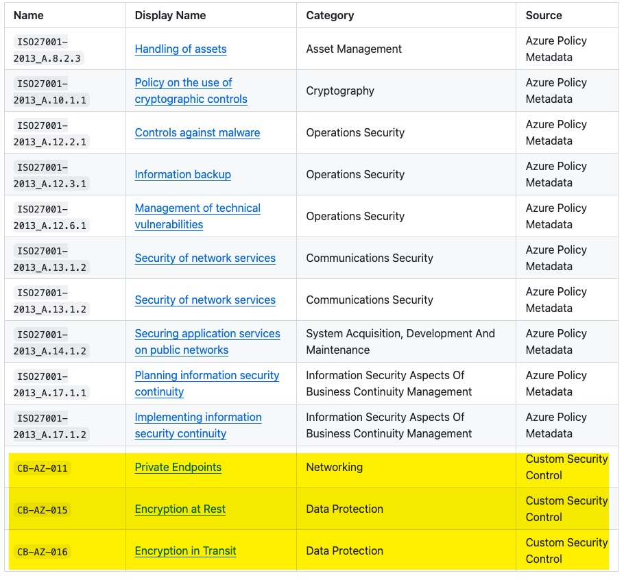

# Create Custom Security Control Catalog

## Why Create Custom Security Control Catalog

By design, customers cannot create additional policy metadata in their Azure environment. customers may face the following challenges when mapping required security controls to the the policy definitions:

1. Your organization has internal security controls that are not publicly available.
2. The publicly available security frameworks your company adopts have not been made available in Azure as built-in policy metadata.
3. The built-in policy metadata for a specific security framework provided by Microsoft may be incomplete, incorrect or not up-to-date.

In these scenarios, there is no way you can access the accurate detail of the security controls in the Azure portal.

To address these challenges, the `AzPolicyLens` PowerShell module provides the capability for you to define and import your custom security control definitions. By doing this, you can build a complete and accurate catalog of security controls that are relevant to your organization, making it easier for your security teams and cloud engineering teams to reference and comply with the required security controls.

More importantly, when you map your custom security controls to the policy definitions in your Azure environment, the generated policy wiki will display these security controls and it's mapping the same way as the built-in policy metadata, providing a seamless experience for your teams.

In the screenshot below, you can see the list of policy definition groups for an initiative, which includes both built-in policy metadata and custom security controls.



The detailed information page for each custom security control is also generated in the same way as the built-in policy metadata.

## How to Create Custom Security Control Catalog

Each custom security control is defined in a separate JSON file. You can specify all json files in a flat folder or creating a sub-folder for each security framework you wish to define.

The JSON file should contain the following properties:

```json
{
  "$schema": "../security-control.schema.json",
  "ControlID": "",
  "Category": "",
  "Name": "",
  "Description": "",
  "Publisher": "",
  "Framework": "",
  "AdditionalInfo": {}
}
```

>:memo: The `AdditionalInfo` object can contain any additional properties that you want to include, for example, URL link to the security control, version, last updated date, applicability, etc. AzPolicyLens does not dictate what properties you should include in the `AdditionalInfo` object, you can customize it based on your organization's needs.

For example, here is a sample custom security control JSON file:

```json
{
  "$schema": "../security-control.schema.json",
  "ControlID": "CB-AZ-001",
  "Category": "Identity & Access Management",
  "Name": "Multi-Factor Authentication (MFA)",
  "Description": "All accounts accessing Azure must require MFA.",
  "Publisher": "Contoso Bank",
  "Framework": "Contoso Bank Azure Security Control Framework",
  "AdditionalInfo": {
    "ApplicableTo": "Mandatory for admins, developers, and end-users accessing financial systems.",
    "LastUpdatedDate": "September 2025",
    "Link": "https://contosowebsite.azurewebsites.net/",
    "Version": "1.0.0",
    "Note": "This dummy control is generated by ChatGPT. It is designed for demonstration purposes only."
  }
}
```

The AzPolicyLens pipelines validate each custom security control JSON file against the [**security-control.schema.json**](../../security-controls/security-control.schema.json) schema file to ensure the JSON files are well-formed and contain all required properties.


## How to Import Custom Security Control Catalog when Generating Policy Wiki

When generating the policy wiki using the `New-AzplPolicyWiki` cmdlet, you can specify the path to the folder that contains your custom security control JSON files using the `CustomSecurityControlPath` parameter. The cmdlet will automatically discover and import all the custom security control definitions from the specified folder **recursively** and include them in the generated policy wiki.
