# GitHub Wiki Setup Guide

## Introduction

This documentation provides a step-by-step guide on how to set up the GitHub Actions Workflow to automatically generate and publish the policy wiki to your Azure DevOps Wiki repository.

This workflow is configured to run on a schedule, ensuring that the documentation is always up-to-date with the latest policies.

The workflow retrieves all relevant Azure resources using Azure Resource Graph queries and then generates policy documentations in markdown files that are compatible with the GitHub wiki.

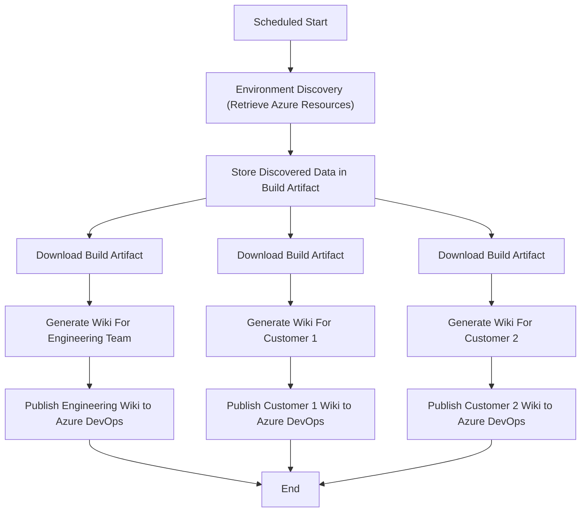

## Prerequisites

### 1. GitHub Repository for the policy wiki workflow

You need to have a GitHub repository where you will host and execute the policy wiki workflow.

### 2. A separate GitHub Repository for Each Wiki instance

You will need to have a separate GitHub repository for each wiki instance that you want to generate and publish.

:memo: The GitHub repositories for the wiki instances do not have to be owned by the same GitHub user or organization.

### 3. Entra ID Service Principal for Accessing Azure Management Group

The GitHub Action workflow is structured to generate wikis for different environment where each environment corresponds to a top-level Azure Management Group.

You need to create a Service Principal in Entra ID that has the **Reader** role for each of the top-level management group you wish to target your policy wikis to.

Follow the documentation for the GitHub [Azure Login Action](https://github.com/marketplace/actions/azure-login) to create the necessary Entra ID identities and grant them the `Reader` role to the Azure Management Groups.

### 4. Personal Access Token (PAT) for Pushing Wiki Content to GitHub Wiki Repositories

For the GitHub Action workflow to push the generated wiki content to the GitHub repositories, you need to create a fine-grained Personal Access Token (PAT) in GitHub with the necessary permissions to access these repositories.

To create the token:

1. Go to your GitHub account settings.
2. Click on "Developer settings" in the left sidebar.
3. Click on "Personal access tokens" and then "Fine-grained tokens".
4. Click on "Generate new token", provide a name and expiration for the token.
5. Select the repositories that the token should have access to (the repositories where the wiki content will be pushed).
6. Under "Permissions", grant the token the following permissions:
   - `Commit statuses`
   - `Contents`

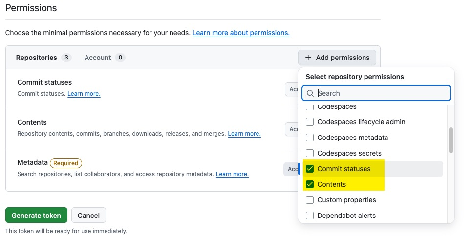

7. Set the access for `Commit statuses` and `Contents` to "Read and write".

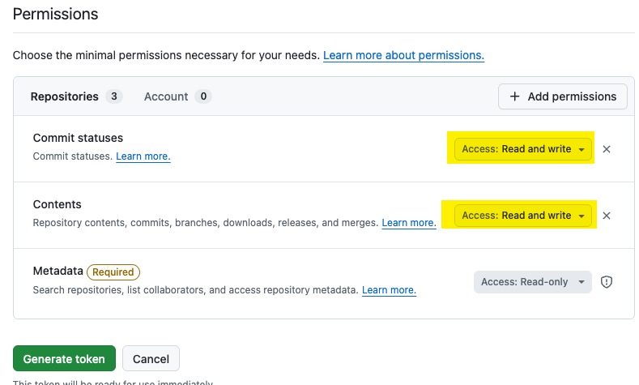

8. Click on "Generate token" and make sure to copy the generated token as it will not be shown again.

After the PAT is generated, you will see the following permissions summary for the token:

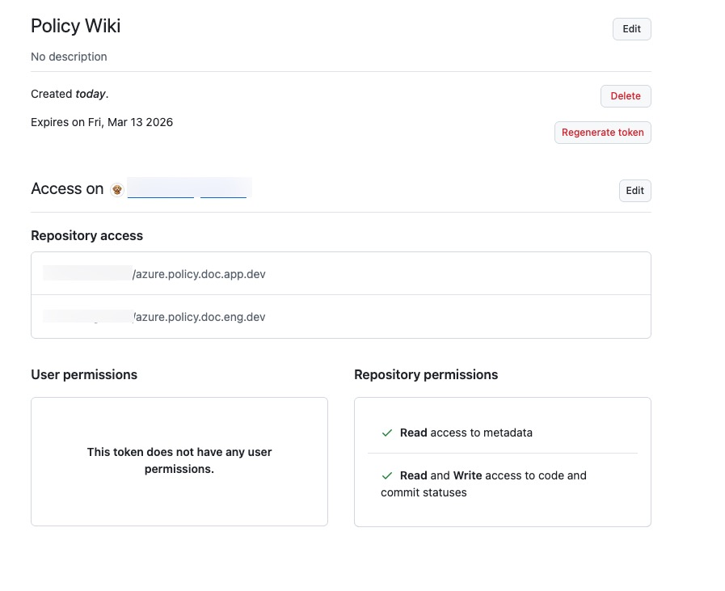

### 5. Software requirements for the GitHub action runner

If you are using GitHub hosted runners, there is no additional software requirement as the necessary tools are already installed. If you are using self-hosted runners, please ensure that the following software is installed:

- PowerShell 7.2 or above
- Azure CLI or Az PowerShell Module (for generating Azure oAuth token during the wiki generation process)
- Git (for pushing the generated wiki content to the Azure DevOps Wiki repository)
- Dotnet 8.0 SDK (for running the AzPolicyLens PowerShell module to generate the wiki content)

For self-hosted runners, the runners must be able to access the Azure Resource Manager API endpoints (https://management.azure.com/).

## Setup Instructions

For each git repository that you have created to host the wiki content, you need to make the following configurations:

### 1. Initialize the Wiki Repository

For each Wiki repository you have created, enable the GitHub wiki feature under the `General` settings of the repository. Make sure `Restrict editing to collaborators only` option is also ticked.

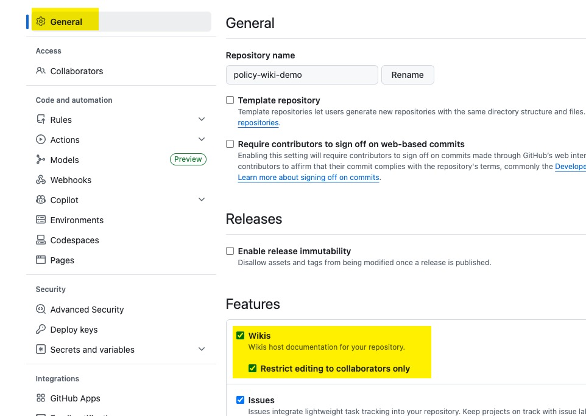

Then go to the `Wiki` tab of the repository and click on `Create the first page` to initialize the wiki repository.

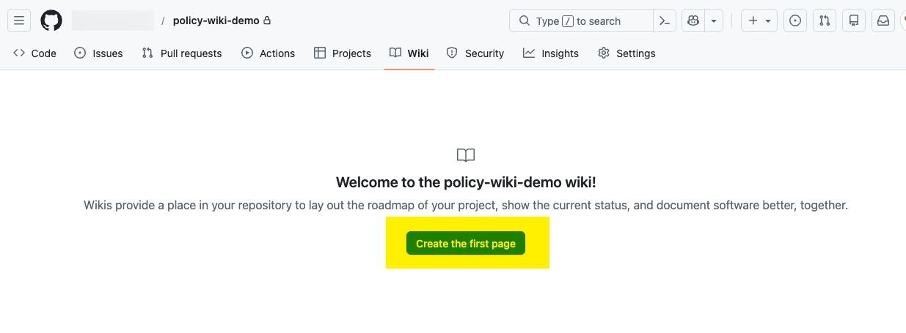

Create a dummy page and publish it to initialize the wiki repository. This page will be deleted later when the workflow runs and pushes the generated wiki content to the repository.

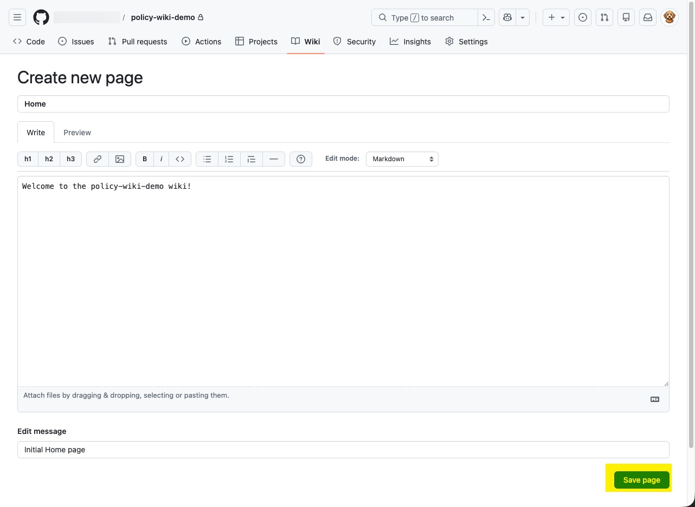

:memo: You will need to capture the Wiki repository URL in the `github-config.jsonc` file in the next step.

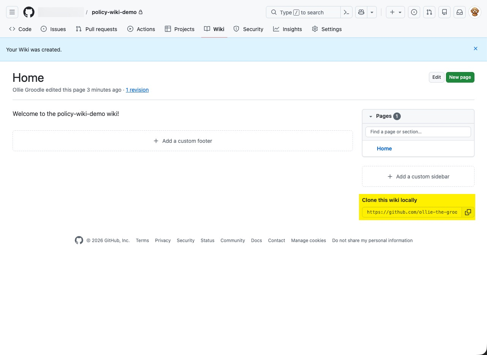

### 2. Configure the Pipeline to Publish to the Wiki Repository

To add the new wiki configurations to the pipeline, you will need to edit the [github-config.jsonc](../../configurations/github-config.jsonc) file in the `policies` repository.

Follow the steps from the [Managing Pipeline Configuration Files](./pipeline-configuration-file.md) page to update the `github-config.jsonc` file.

### 3. Configure additional metadata for the wiki (Strongly Recommended)

:memo: Refer to the [Define Additional Built-In Policy Metadata](./additional-built-in-policy-metadata.md) guide for details about this feature.

Follow the steps from [Managing Pipeline Configuration Files](./pipeline-configuration-file.md) page to update the `additional-policy-metadata-config.jsonc` file.

### 4. Define Custom Security Controls (Optional)

If you have internal security controls or security controls that are not available in Azure as built-in policy metadata, you can define them as custom security controls and include them in the policy wiki.

Follow the steps from the [Create Custom Security Control Catalog](./custom-security-control-catalog.md) guide to define your custom security controls and include them in the policy wiki.

Before you generate the policy wiki, please also make sure the security controls are properly mapped to the relevant policy definitions in the initiative definitions. You can follow the steps from the [How to Map Security Controls to Azure Policies](./map-security-controls.md) guide to do this.

### 5. Configure the Workflow Schedule

Follow the steps from the [How to Setup Pipeline and Workflow Schedules](./pipeline-schedules.md) page to set up the pipeline schedule to suit your business requirements.

### 6. Generate an Encryption Key for Encrypting the Discovery Artifact (Optional but Strongly Recommended)

The environment discovery artifact contains the details of your Azure environment, which may include sensitive information. It is recommended to encrypt the discovery artifact before storing it as a build artifact and decrypt it during the wiki generation process.

Follow the steps from the [Create Encryption Key for Environment Discovery Artifact](./encryption-key-environment-discovery.md) guide to create the encryption key for the pipeline to use.

You will need to store the `key` and `IV` values as Action secrets in the GitHub repository where the wiki workflow is hosted and reference these secrets in the workflow file for encrypting and decrypting the discovery artifact.

### 7. Store the necessary secrets in GitHub Repository as Action Secrets

The following secrets need to be stored in the GitHub repository where the wiki workflow is hosted:

| Secret Name | Description |
| :---------- | :---------- |
| `EncryptionKey` | The content of the encryption key file you generated in step 6. |
| `EncryptionIV` | The initialization vector (IV) for the encryption key you generated in step 6. |

For each wiki instance, you will also need to store the following secrets:

 - GitHub user ID
 - GitHub fine-grained PAT with access to the wiki repository that you have created earlier.

For each environment (Azure Management Group) that you want to generate wiki for, you will also need to store the following secrets:

  - A json string that maps the credential for the [Azure Login Action](https://github.com/marketplace/actions/azure-login#creds)

The workflow uses the `creds` input of the Azure Login Action to authenticate to Azure and generate an Azure oAuth token for accessing the Azure Resource Manager API during the wiki generation process.

Please refer to the GitHub documentation for `Azure Login Action` for how to create such credential json string and store it as GitHub Action secrets.

### 8. Configure the Workflow Variables

**1. Update the `settings.yml` file**
The common Azure DevOps pipeline and GitHub Action workflow variables are defined in the [settings.yml](../../settings.yml) file in the root directory of this repository. This file contains common variables that are used in both Azure DevOps Pipeline and GitHub Actions workflow.

The variables are explained in detail in the [Managing Pipeline and Workflow Variable File](./pipeline-variable-file.md) guide.

Please review and configure the variables in the `settings.yml` file as needed before running the workflow.

**2. Update the Azure credential secrets for each discovery job in the workflow file**

For each discovery job (`job_discovery_<environment>`), Set the `AZURE_CREDENTIALS` environment variable to reference the corresponding GitHub Action secret that contains the credential json string for the Azure Login Action. i.e.

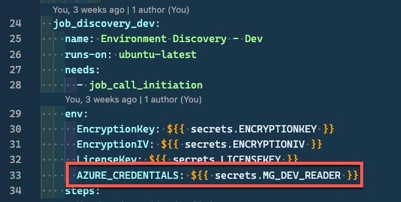

In this example, the secret name `MG_DEV_READER` references the Action secret created earlier.

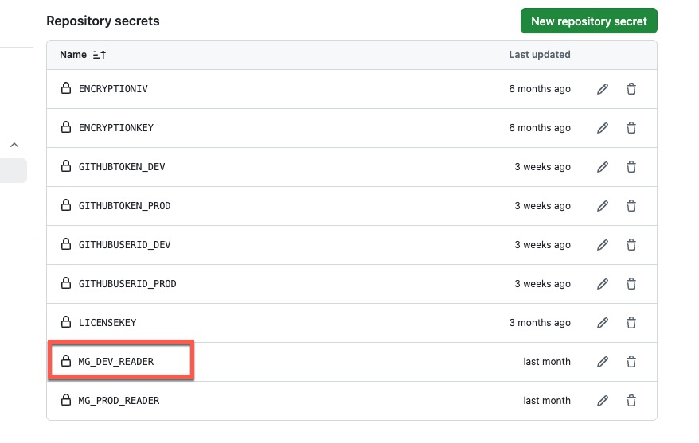

**3. Update the GitHub User ID and PAT secrets for each wiki generation job in the workflow file**

For each wiki generation job (`job_generate_wiki_<environment>`), set the `GithubUserId` and `GithubToken` environment variables to reference the corresponding GitHub Action secrets that contain the GitHub user ID and PAT for pushing the generated wiki content to the GitHub wiki repository. i.e.

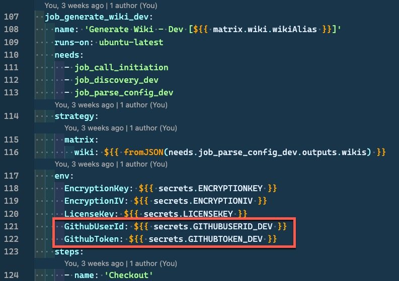

In this example, the secret names `GITHUBUSERID` and `GITHUBTOKEN` reference the Action secrets created earlier.

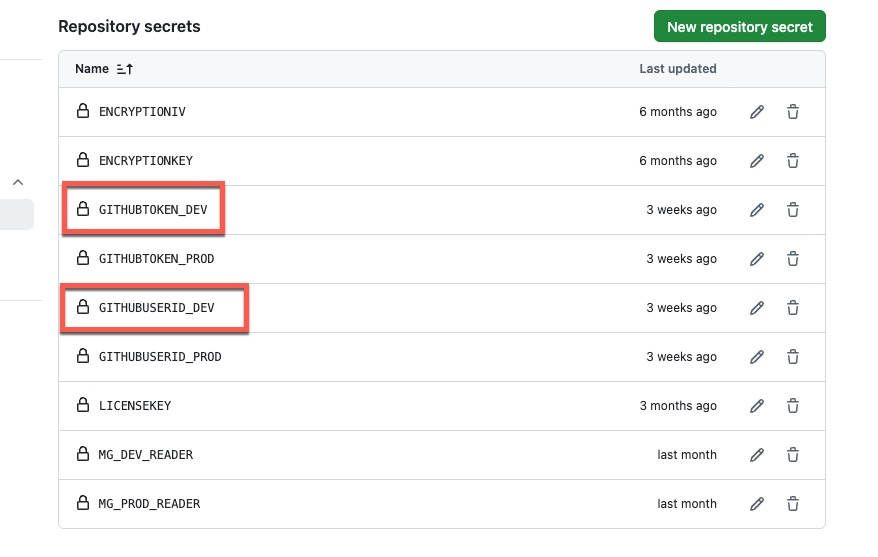

**4. Make sure the `buildArtifactName` input for each discovery job matches the `buildArtifactName` input in the corresponding wiki generation job**

The discovery job generates a build artifact that contains the discovered environment data, and the wiki generation job consumes this artifact to generate the wiki content. Therefore, the `buildArtifactName` input in the discovery job must match the `buildArtifactName` input in the corresponding wiki generation job to ensure that the correct artifact is consumed.

For example, the `job_discovery_dev` job has the `buildArtifactName` input set to `policy_doc_dev`:

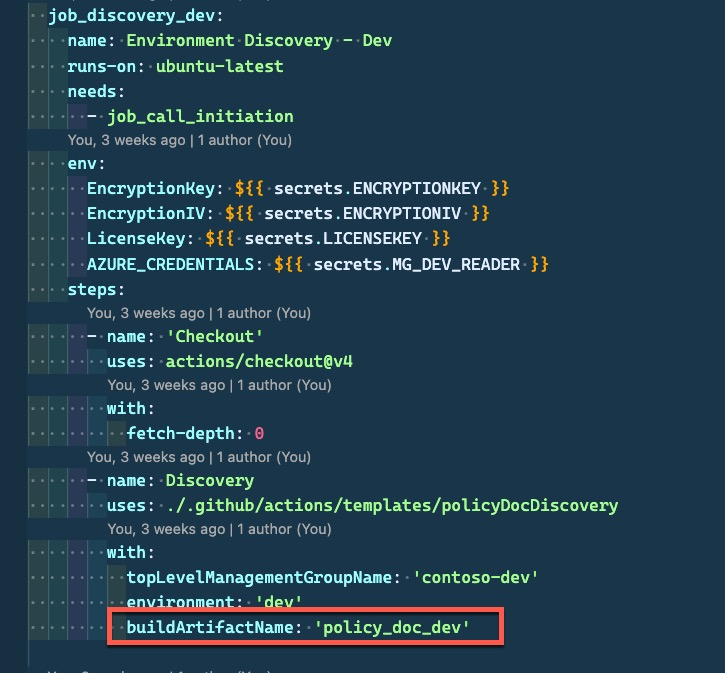

In the Wiki generation job, `job_generate_wiki_dev`, the `buildArtifactName` variable is also set to `policy_doc_dev`:

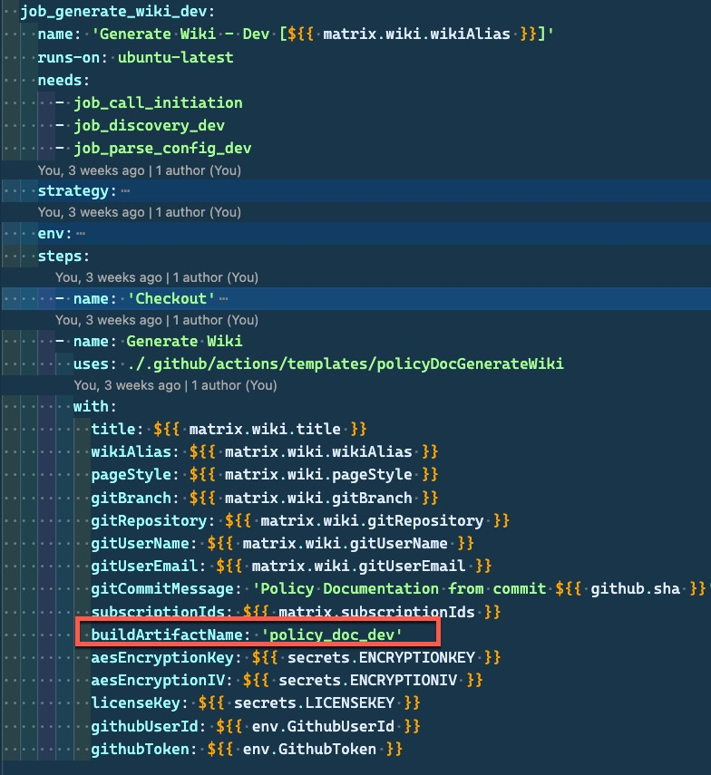

**5. Make sure the `environment` input for each wiki discovery job and parse configuration job matches the corresponding environment name in the `github-config.jsonc` file for the wiki instance you want to generate.**

For example, the `dev` environment is defined in the following 3 locations:

- In the [github-config.jsonc](../../configurations/github-config.jsonc) file

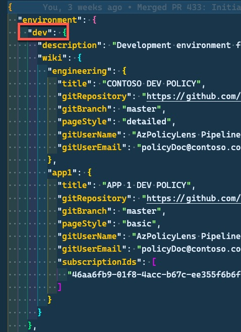

- In the `job_discovery_dev` job as the value for the `environment` input

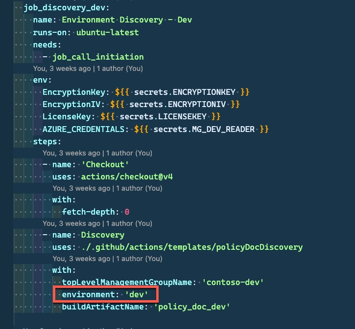

- In the `job_parse_config_dev` job as the value for the `environment` input

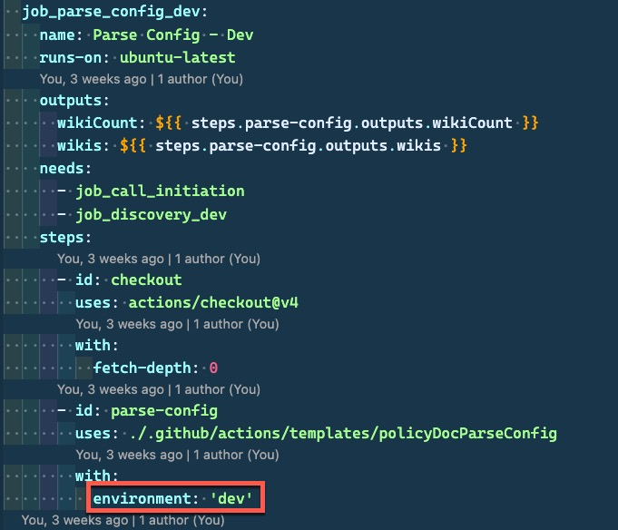

  :memo: By default the pipeline is configured to use the GitHub hosted runner image `ubuntu-latest`. If you want to use self-hosted runners, job in the workflow YAML file, replace `runs-on: ubuntu-latest` with self hosted runners. Details about self-hosted runner can be found in the GitHub documentation [Using self-hosted runners in a workflow](https://docs.github.com/en/actions/how-tos/manage-runners/self-hosted-runners/use-in-a-workflow).

### 9. Commit and push the changes to the GitHub repository

After all the necessary configurations are done, commit and push the changes to the GitHub repository.

### 10. Test run the workflow

You can manually trigger a run of the workflow to verify that the workflow can successfully generate and publish the wiki to the GitHub Wiki repository.

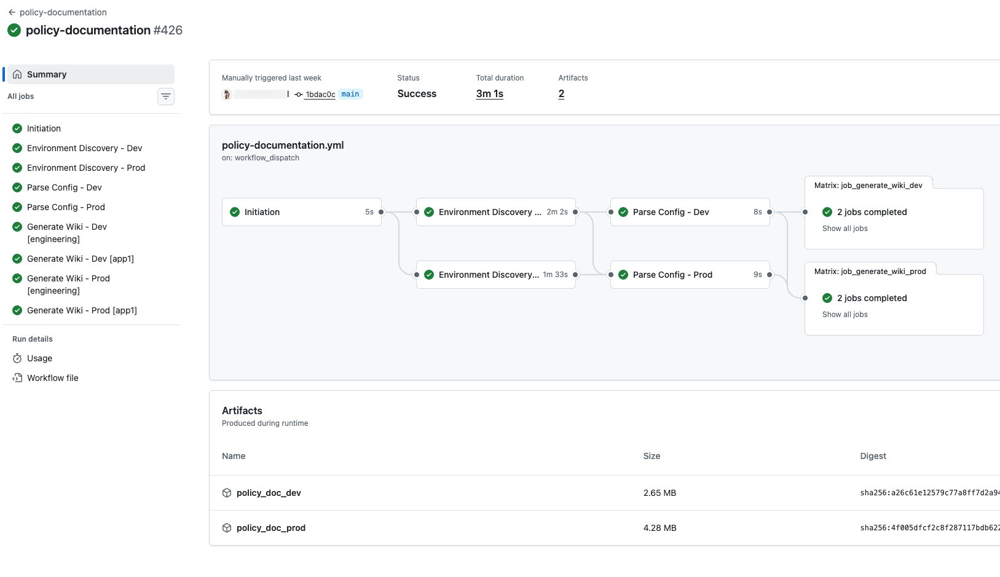

:memo: Note: the wiki instances generated in the `prod` stage of the workflow can only be generated when the workflow is kicked off from the default branch (i.e. main branch). If you are testing the workflow in a feature branch, the wiki will only be generated in the `dev` stage

### 11. Set up additional environments and jobs if required (Optional)

In this GitHub Action workflow context, an `environment` represents a top-level Azure Management Group that you want to target the policy wiki to. Each environment requires 2 stages in the pipeline - one for environment discovery and one for wiki generation and publishing.

Out of the box, the pipeline is configured with 2 environments - `dev` and `prod`, and this is reflected in the [github-config.jsonc](../../configurations/github-config.jsonc) file too. You may need to setup additional environments and stages in the pipeline. To do so, you need to:

1. Modify the [policy-documentation.yml](../../.github/workflows/policy-documentation.yml) file to add the new discovery and wiki generation stages for the additional environments. You can follow the existing pattern of the `dev` and `prod` stages to add new stages.

2. Update the [github-config.jsonc](../../configurations/github-config.jsonc) file to add the new environment and wiki repository configurations for the new stages.

## Setting Up Additional Wiki Instances in the future

When you want to set up additional wiki instances in the future, you can simply repeat steps 1-2 from the above instructions.

If the new wiki instance is targeting a different top-level management group that is not included in the existing pipeline stages, you will also need to:

1. create a new service principal with Reader role to the new management group as described in the prerequisites section and create an Action secret to store the credential for the Azure Login Action to authenticate to the new management group.
2. Add new jobs to the workflow for the new environment as described in step 11.
3. Repeat step 8 to configure the necessary secrets and variables for the new jobs in the workflow.
